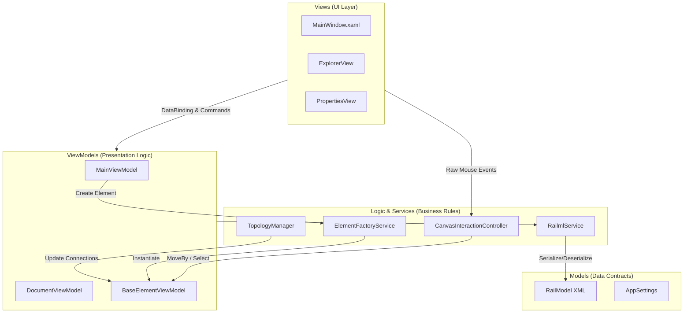
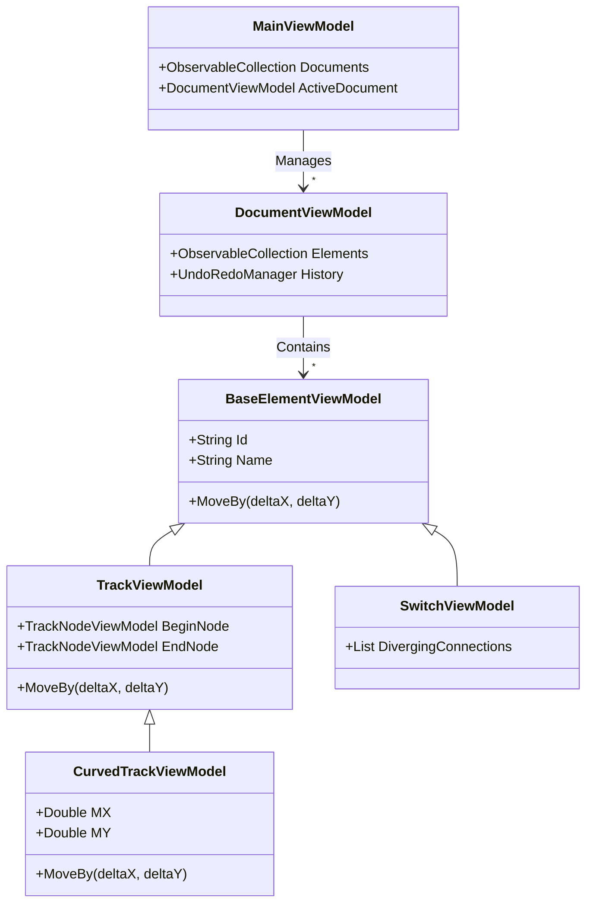
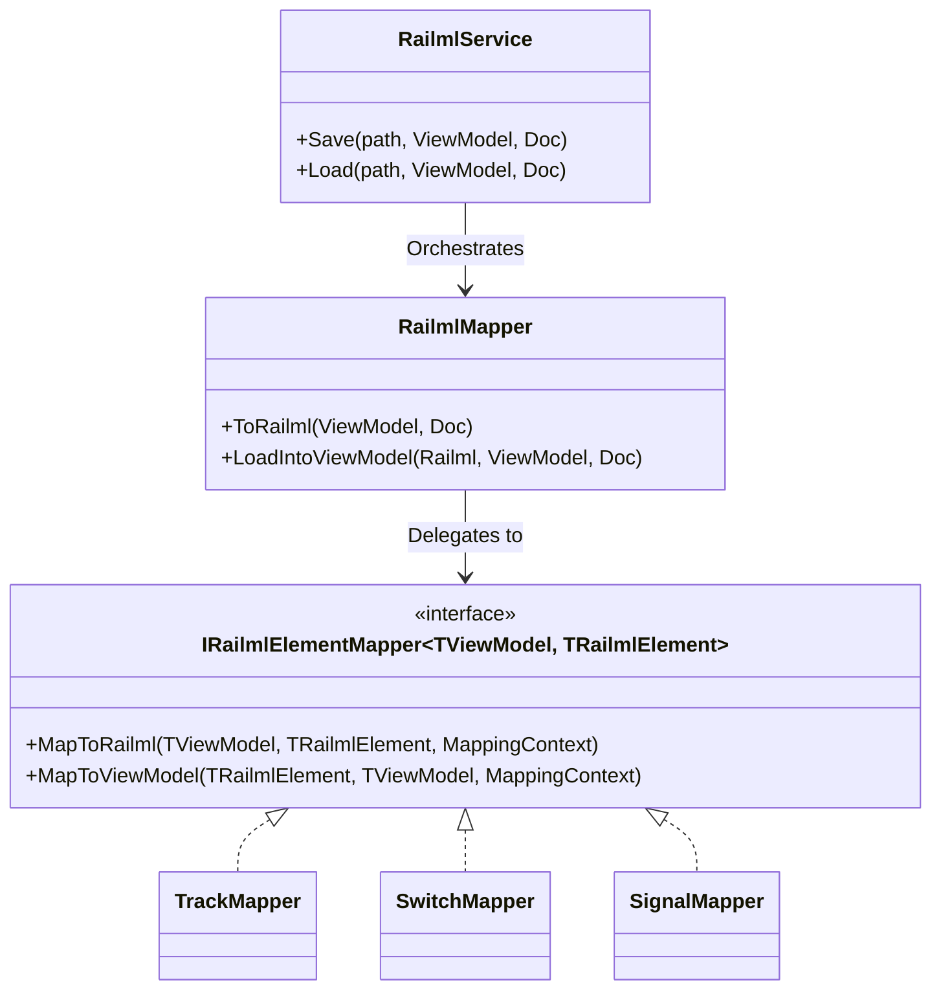
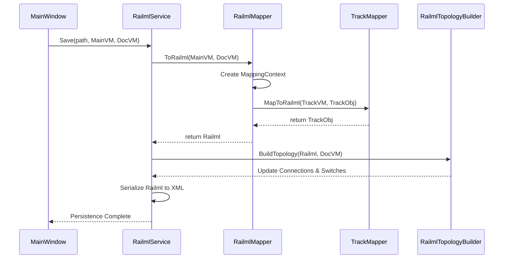
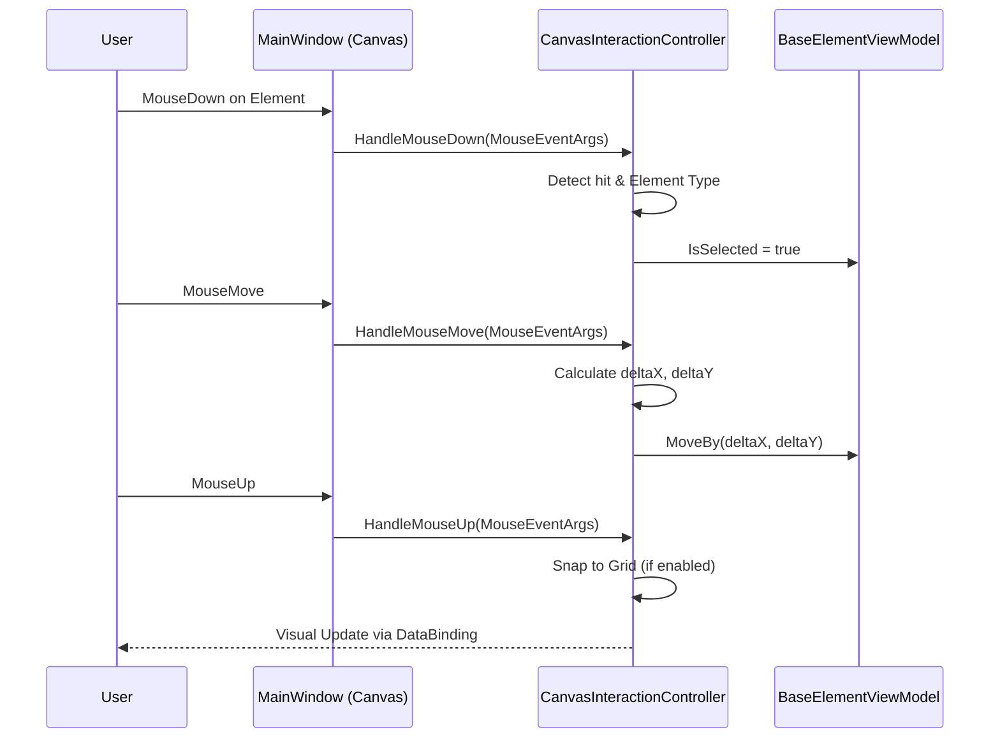

# RailML Editor

A WPF-based desktop application for editing and visualizing railway infrastructure files in RailML format.

## Overview
RailML Editor provides a comprehensive environment for designing and managing railway infrastructure. It allows users to place elements like tracks, signals, and switches on a canvas, configure their properties, and define complex routes. The application is designed to be compliant with the RailML 2.5 standard for data persistence.

## Key Features
- **Infrastructure Elements**: Add and configure Tracks (Straight/Curved), Signals, and Points (Switches).
- **Route Management**: Advanced interface for defining Routes, including switch alignment, overlap settings, and release sections.
- **Intuitive GUI**:
  - Drag-and-drop toolboxes for easy element placement.
  - Explorer-style tree view for hierarchical navigation.
  - Dynamic property grid for detailed configuration.
  - Smooth pan and zoom canvas.
- **RailML Standard**: Save and load infrastructure data in standard RailML 2.5 XML format.
- **Modern UI**: Custom-styled TreeView and themed toolbar icons for a premium look and feel.

## Architecture

After recent structural refactoring, the project adheres closely to MVVM and the Single Responsibility Principle.

### System Architecture Diagram

### Class Diagram: ViewModels

### Class Diagram: Mappers

RailML mapping logic has been extracted into highly cohesive interface-bound classes.

### Sequence Diagram: Saving a Document

### Sequence Diagram: Canvas Interaction (Drag & Drop)

## Getting Started

### Prerequisites
- .NET 6.0 or higher
- Visual Studio 2022 (recommended)
- *Note: For Windows/WSL specific build instructions, see [Build Policies](docs/BuildPolicies.md)*
- *Note: Before releasing, follow the [Smoke Test Plan](docs/SmokeTestPlan.md)*

### Installation
1. Clone the repository.
2. Open `RailmlEditor.sln` in Visual Studio.
3. Build and run the project.

## License
This project is licensed under the MIT License - see the [LICENSE](LICENSE) file for details.
